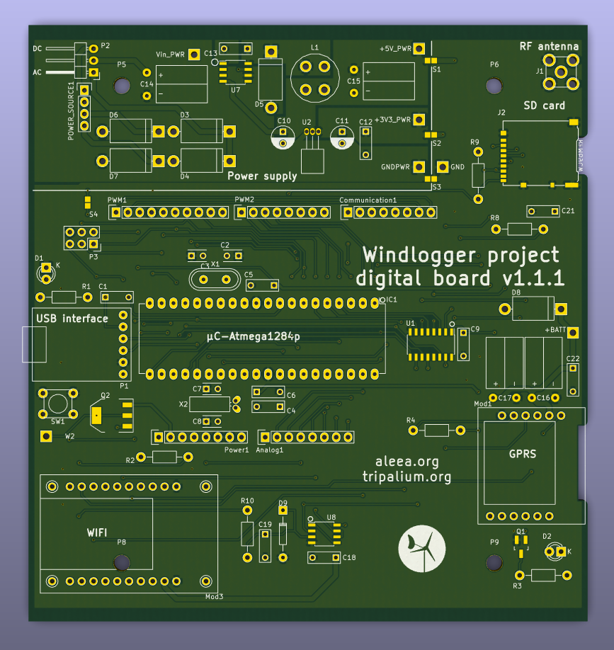

# windlogger_digital v111

The windlogger digital board is a arduino like board based on the Atmega 1284p.

This repo is on the version 1.1.1.

Go on the [wiki](https://github.com/netbomo/windlogger_digital/wiki) for more information.

## BLOCK DIAGRAM

todo

## RENDER PREVIEW

